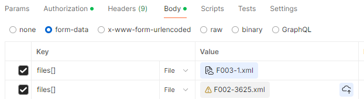

# Proyecto: Gestión de Comprobantes de Pago (Vouchers)

Este proyecto implementa un sistema para gestionar comprobantes de pago mediante una API RESTful. Proporciona funcionalidades avanzadas, como filtros personalizados, eliminación lógica, y autenticación mediante JWT.

## Introducción

Este proyecto tiene como objetivo facilitar la gestión de comprobantes de pago para usuarios autenticados. Las funcionalidades principales incluyen:

    Almacenamiento de comprobantes por XML.
    Listado de comprobantes.
    Filtros avanzados (por fecha, serie, número, tipo de comprobante, moneda).
    Eliminación lógica de comprobantes.
    Soporte para relaciones con líneas de comprobantes y usuarios.
    Paginación en las consultas.

## Tecnologias usadas

    PHP >= 8.1
    Composer
    Laravel >= 10.x
    MySQL / SQLite
    Postman (opcional, para pruebas de API)

## Uso de la API (Endpoints Principales)

### Listar comprobantes (con filtros avanzados)

Muestra el listado de comprobantes que han sido registrados para el usuario autenticado.
```bash
    GET /api/v1/vouchers
```
    Parámetros:
        page (int) (required)
        paginate (int) (required)
        series (string)
        number (string)
        document_type (string)
        currency (string)
        start_date (YYYY-MM-DD) (required)
        end_date (YYYY-MM-DD) (required)

    Ejemplo de Uso:
```bash
GET /api/v1/vouchers?page=1&paginate=10&series=B001&start_date=2023-01-01&end_date=2023-12-31
Authorization: Bearer <token>
```
### Almacenar comprobantes

Almacena comprobantes de formato XML. También realiza un envío de correo en segundo plano con detalles de comprobantes que se guardaron correctamente y no.

```bash
    POST /api/v1/vouchers
```
    Body:
        Key: File .xml
        Key: File[] .xml .xml .xml

    Ejemplo de Uso:

```bash
POST /api/v1/vouchers
Authorization: Bearer <token>
```


### Regularizar comprobantes

Regulariza los comprobantes existentes en la base de datos llenando los datos usando el .xml almacenado:
        series (string)
        number (string)
        document_type (string)
        currency (string)

Nota: Los datos actuales generados en la base de datos no son .xml por lo que no se puede realizar la regularización.

```bash
PUT /api/v1/vouchers
```

Ejemplo de Uso:
```bash
    PUT /api/v1/vouchers
    Authorization: Bearer <token>
```
### Obtener totales de comprobantes

Otorga las sumas totales de los comprobantes pertenecientes al usuario separados por tipo de moneda.
Totales mostrados en PEN y USD.

```bash
GET /api/v1/vouchers/total-amounts
```
Parámetro Requerido:

    voucher_id (string)

Ejemplo de Uso:
```bash
    GET /api/v1/vouchers/total-amounts
    Authorization: Bearer <token>
```

### Eliminar comprobante

Elimina un comprobante perteneciente al usuario autenticado.
```bash
DELETE /api/v1/vouchers
```
Parámetro Requerido:

    voucher_id (string)

Ejemplo de Uso:
```bash
    DELETE /api/v1/vouchers?voucher_id=9ddf7376-8995-44d6-9362-f739a3324cf9
    Authorization: Bearer <token>
```

## Ejecucion de Pruebas

Configura el entorno de pruebas:
```bash
    php artisan config:cache
    php artisan test --env=testing
```

Cobertura de pruebas:
    Pruebas unitarias para servicios y controladores.
    Pruebas de características para endpoints (GET, DELETE).

Test disponibles:

Realiza todos los tests.
```bash
    php artisan test
```
Nota: Algunos test no funcionan cuando son llamados grupalmente pero si individualmente.

Realiza feature test.
```bash
    php artisan test --filter=GetVouchersTest
    php artisan test --filter=VoucherDeletionTest
    php artisan test --filter=VoucherTotalAmountTest
```

Realiza unit test.
```bash
    php artisan test --filter=VoucherProcessedMailTest
    php artisan test --filter=VoucherServiceTest
```

Autor

    Juan Alberto De La Cruz Sairitupa
    Desarrollador Backend

