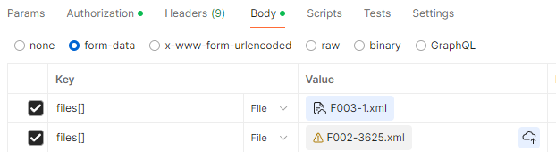

# Invoice Recorder API — Gestión de Comprobantes de Pago

API RESTful en Laravel para registrar y administrar comprobantes de pago electrónicos (XML) de facturación peruana (UBL). Extrae automáticamente emisor, receptor, montos y líneas de detalle desde el XML, con autenticación JWT, filtros avanzados, totales por moneda y eliminación lógica.

🎥 [Video demo del proyecto](https://drive.google.com/file/d/19zGtKfQhG4kD31EZpKSe4olOLCVeJZfq/view?usp=sharing)

## Características

- Registro masivo de comprobantes a partir de archivos XML (parseo UBL con SimpleXML).
- Notificación por correo (en segundo plano) con el resultado de cada carga (éxitos y fallos).
- Listado de comprobantes con filtros y paginación.
- Regularización automática de comprobantes con datos incompletos, reprocesando su XML almacenado.
- Totales de comprobantes agrupados por moneda (PEN, USD, etc.).
- Eliminación de comprobantes por usuario autenticado.
- Autenticación mediante JWT (registro, login, logout).

## Tecnologías usadas

- PHP ^8.1
- Laravel ^10.10
- tymon/jwt-auth ^2.0 (autenticación JWT)
- MySQL 8.0
- Docker / Docker Compose
- PHPUnit ^10.1

## Instalación y ejecución

Requiere Docker y Docker Compose.

```bash
git clone <repo-url>
cd idbi-invoice-recorder-challenge
cp .env.example .env
docker compose up -d
docker compose exec web composer install
docker compose exec web php artisan key:generate
docker compose exec web php artisan jwt:secret
docker compose exec web php artisan migrate
```

La API queda disponible en `http://localhost:8080`.

Servicios levantados:
- `web`: aplicación Laravel (Nginx + PHP 8.1) en el puerto `8080`.
- `db`: MySQL 8.0 en el puerto `3306`.
- `mail`: MailHog para capturar correos de prueba, UI en `http://localhost:8025`.

## Autenticación

### Registrar usuario
```bash
POST /api/v1/users
```
Body:
```json
{
    "name": "Juan",
    "last_name": "De La Cruz",
    "email": "juan@example.com",
    "password": "password123"
}
```

### Iniciar sesión
```bash
POST /api/v1/login
```
Body:
```json
{
    "email": "juan@example.com",
    "password": "password123"
}
```
Devuelve un token JWT a usar como `Authorization: Bearer <token>` en el resto de endpoints.

### Cerrar sesión
```bash
POST /api/v1/logout
Authorization: Bearer <token>
```

## Endpoints de comprobantes (requieren `Authorization: Bearer <token>`)

### Listar comprobantes (con filtros avanzados)

Muestra el listado de comprobantes registrados por el usuario autenticado.
```bash
GET /api/v1/vouchers
```
Parámetros:
- `page` (int) **requerido**
- `paginate` (int) **requerido**
- `start_date` (YYYY-MM-DD) **requerido**
- `end_date` (YYYY-MM-DD) **requerido**
- `serie` (string)
- `number` (string)
- `type` (string)
- `currency` (string)

Ejemplo de uso:
```bash
GET /api/v1/vouchers?page=1&paginate=10&serie=F002&start_date=2023-01-01&end_date=2023-12-31
Authorization: Bearer <token>
```

### Almacenar comprobantes

Almacena comprobantes en formato XML y envía un correo en segundo plano con el detalle de los comprobantes guardados correctamente y los que fallaron.

```bash
POST /api/v1/vouchers
```
Body (multipart/form-data):
- `files`: archivo(s) `.xml`

Ejemplo de uso:
```bash
POST /api/v1/vouchers
Authorization: Bearer <token>
```


### Regularizar comprobantes

Busca todos los comprobantes del sistema con campos incompletos (`series`, `number`, `document_type` o `currency` nulos) y los completa reprocesando el XML que tienen almacenado. No recibe parámetros.

```bash
PUT /api/v1/vouchers
Authorization: Bearer <token>
```

### Obtener totales de comprobantes

Devuelve la suma de montos de los comprobantes del usuario autenticado, agrupados por moneda.

```bash
GET /api/v1/vouchers/total-amounts
Authorization: Bearer <token>
```

### Eliminar comprobante

Elimina (soft delete) un comprobante perteneciente al usuario autenticado.
```bash
DELETE /api/v1/vouchers
```
Parámetro requerido (query string):
- `voucher_id` (string, UUID)

Ejemplo de uso:
```bash
DELETE /api/v1/vouchers?voucher_id=9ddf7376-8995-44d6-9362-f739a3324cf9
Authorization: Bearer <token>
```

## Ejecución de pruebas

Configura el entorno de pruebas:
```bash
php artisan config:cache
php artisan test --env=testing
```

Cobertura de pruebas:
- Pruebas unitarias para servicios y notificaciones.
- Pruebas de características (feature) para endpoints de listado, eliminación y totales.

Ejecutar todos los tests:
```bash
php artisan test
```
Nota: algunos tests no funcionan cuando se ejecutan de forma grupal, pero sí individualmente.

Feature tests:
```bash
php artisan test --filter=GetVouchersTest
php artisan test --filter=VoucherDeletionTest
php artisan test --filter=VoucherTotalAmountTest
```

Unit tests:
```bash
php artisan test --filter=VoucherProcessedMailTest
php artisan test --filter=VoucherServiceTest
```

## Autor

**Juan Alberto De La Cruz Sairitupa**
Desarrollador Backend
